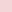
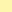
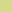
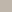
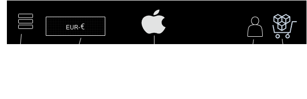

# DEKOR STORE 
 - Nombre negocio: *DEKOR*  
 - Tematica:
     -  Negocio de decoracion.  
     -  Shoping online.
     -  Productos artesanales.

 - Valores de la empresa: Amigable con el medio ambiente, papel reciclado y arcilla.  
 - Idea Principal: Dar vida al hogar, siendo amigables con el medio ambiente y con gran elegancia.  
 - Tipo de colores pagina: Paleta de colores pastel.  
 - Implementar: Adaptacion de precio FLAMINGUEO (Web referencia)  

## Índice
- [ DEKOR STORE ](#dekor-store)
- [ Índice ](#índice)
- [ Introducción](#introducción)
- [ Información cabecera ](#información-cabecera)
- [ Sección en el lateral izquierdo](#sección-en-el-lateral-izquierdo)
- [Pagina/Seccion Valores de la empresa y quienes son](#pagina-o-sección-valores-de-la-empresa-y-quienes-són)
- [ Footer ](#footer)
- [Sección de preguntas frecuentes y Formulario. ](#sección-de-preguntas-frecuentes-y-formularios)
	- [ Contenido principal Formulario ](#contenido-principal-formulario)
- [ Implementaciones adicionales ](#implementaciones-adicionales)
- [ Referencias a tener en cuenta ](#referencias-a-tener-en-cuenta)
- [Enlaces a las Webs](#enlaces-a-las-webs)
- [ Colores a utilizar ](#colores-a-utilizar)
- [Lista de implementaciones ](#lista-de-implementaciones)

## Introducción
Se desea desarrollar una web para un negocio online de venta de elementos decorativos artesanales y elegantes.  
La compañia desea que la web trasmita tanto la elegancia de los productos. Dando apoyo a los productos artesanales y siendo amigables con el medio ambiente.    

## Información cabecera   
- Icono superior que debe redirige a la pagina principal (Posicionar donde mas se adecue para darle elegancia a la pagina).  
- Barra superior con menu de navegacion basado en iconos (contraco, devoluciones, punto de recogida,...).  
- Navegacion con menu horizontal desplegable.    
  
## Sección en el lateral izquierdo 
- Lateral izquierdo redes sociales, esta debe estar en una linea estrecha que permanezca todo el rato en la pantalla, las redes sociales deben aparecer en forma de iconos.
  
## Pagina o Sección Valores de la empresa y quienes són 
- Foto grande estilo cartel, en un apartatado acompañado la presentacion de la empresa y que tratan de transmitir.  

## Footer  
- En el footer debe aparecer el nombre de la marca en forma de logo o de texto con una tipografia adecuada. Debe actual como boton saber mas.  

## Sección de preguntas frecuentes y Formulario. 
- Esta sección estara dedicada a las disrintas consultas pueden presentar los clientes y un pequeño formulario en caso de que tengan otras dudas.    
 	
    ### Contenido principal Formulario 
    - Campo email contacto.
    - Apartado de nombre.  
    - Selector de motivo de consulta.  
    - Si selecciona otro se debe mostrar campo para el asunto.  
    - Campo para explicar los motivos de su consulta.   
    - Boton de enviar y boton de resetear.  
	
## Implementaciones adicionales 
 - Despleagable con menu de personalizar (este se pretende que se depliegue en una linea inferior horizontal).    
 - Bordes imagenes productos redondeados.    
 - Seccion con foto fondo estilo tarjeta.    
 - Buscar tipografias para productos, precios. Color acorde a la pagina.    
 - **Scroll dinamico Apartado Sobre nosotro. En lugar de desplegables.(Implementacion opcional, revisar contenedores estilo galeria.)**    

## Referencias a tener en cuenta   
 - Flamingueo: CTA y header.     
 - Glow Recipe y Flamingueo: Imagenes, recordar tarjetas para productos. Tambien tener encuenta el footer.
 - Apartado de consejos.(Cuando selecciones un producto que te proponga otros que puedan quedar bien).
 > [!IMPORTANT] 
 > Dificil Implementación sin datos que relacionen los productos mediante etiquetas.
 > Para un funcionamiento mas o menos real seria necesario un Base de datos con los productos y scrips para consultarla.

 > [!NOTE]
 > Para una primera implementacion de ejemplo se podria hacer, en caso de disponer de tiempo suficiente, seria un sistema que recomiende productos fijos
 > esto proporcionaria un aproximado de la idea original. 
 
 ### Enlaces a las Webs
 > [!IMPORTANT]
 > - [Flamingueo](https://flamingueostore.com/)  
 > - [Glow Recipe](https://www.glowrecipe.com/)
 > - [Freepick](https://www.freepik.es/iconos/web)
   
 > [!NOTE]
 > > Se pueden usar otras alternatrivas para todos los icononos necesarios para la web.

 
 ## Colores a utilizar 
> [!TIP]
> Como idea inicial para el uso de los colores en la implementación de la web. Se podrian aprovechar los coloresmas intensos para los textos, mientras que los mas claros
> para los distintos backgrounds de buscando que resalten mas los productos.
  

 #FFFFFF 

 #F2D7D7 

 #FFA175 

 #FFF6AD 

 #D7D98A 
  

#BFB6AB 

## Ejemplo header

     

 1. Icono del menu desplegable. (Inicialmente debe ser horizontal)
 2. Selector de moneda.
 3. Logo de la marca/compañia.
 4. Icono de perfil del usuario.(A futuro: loggin, con distintos subapartados para seguimiento de pedidos historial, etc).
 5. Carrito donde se añadiran pedidos.

## Lista de implementaciones 
- [ ] Dar una estructura basica a la pagina principal.
- [ ] Crear header segun los criterios establecidos (Utilizando iconos para el menu de navegacion, desplegables,etc).
- [ ] Crear footer, este debe ser suficientemente espacioso.
- [ ] Crear pagina Sobre Nosotros. La cual debe mostrar la imagen que desea representar la marca sus ideas entre otros.
- [ ] Formulario de contacto en conjunto, con la parte de preguntas frecuentes. 
